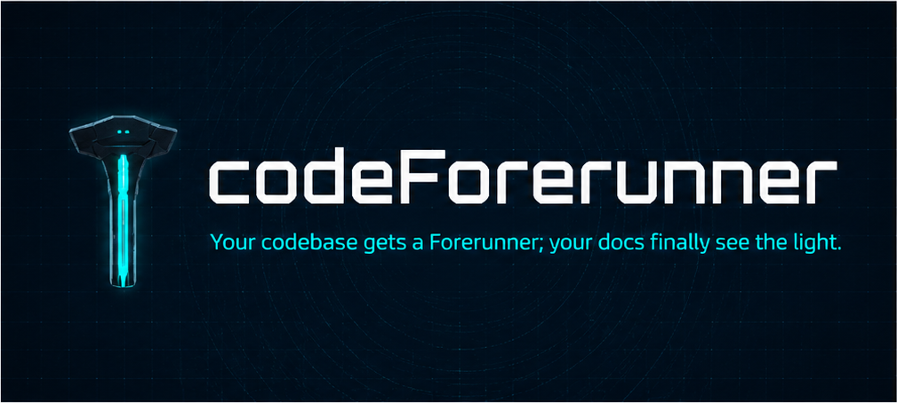

# codeForerunner

[](https://badge.socket.dev/npm/package/codeforerunner/0.4.4)

Model-agnostic repository documentation tooling. Ships a prompt pack for codebase analysis and doc generation, a thin Python CLI, an MCP server, drift-detection rules that keep docs honest — and native slash-command skills for Claude Code, Codex, Gemini CLI, and other agent CLIs.

## Install

Install forerunner's prompt pack as skills into your agent CLI. Each documentation task becomes a slash command (`/forerunner-readme`, `/forerunner-check`, etc.) available inside Claude Code, Codex, Gemini CLI, and other agents. Authentication is handled by your existing agent subscription — no separate API key needed.

```bash
# From a cloned repo
./install.sh

# One-liner (auto-detects Claude Code, Codex, Gemini CLI)
curl -fsSL https://raw.githubusercontent.com/derek-palmer/codeforerunner/main/install.sh | bash

# npm
npx -y codeforerunner
npm install -g codeforerunner

# Windows
irm https://raw.githubusercontent.com/derek-palmer/codeforerunner/main/install.ps1 | iex

# Via Python CLI
pip install codeforerunner
forerunner install --all claude
forerunner install --all codex
```

Then in your agent:

```
/forerunner-scan        ← scan the repo first
/forerunner-readme      ← generate README
/forerunner-check       ← detect doc drift
/forerunner-refresh     ← scan + update all stale docs
```

## Slash commands

| Command | Task | Purpose |
|---------|------|---------|
| `/forerunner-scan` | `scan` | Collect repo evidence (run first) |
| `/forerunner-readme` | `readme` | Generate or refresh README.md |
| `/forerunner-api-docs` | `api-docs` | Generate API reference docs |
| `/forerunner-diagrams` | `diagrams` | Generate Mermaid architecture diagrams |
| `/forerunner-flows` | `flows` | Document system flows |
| `/forerunner-stack-docs` | `stack-docs` | Stack-specific developer docs |
| `/forerunner-version-audit` | `version-audit` | Audit pinned versions vs EOL |
| `/forerunner-check` | `check` | Check docs for staleness |
| `/forerunner-review` | `review` | Doc-impact summary for PR review |
| `/forerunner-audit` | `audit` | Security and dependency audit |
| `/forerunner-changelog` | `changelog` | Generate changelog from git log |
| `/forerunner-init` | `init-agent-onboarding` | Bootstrap or refresh AGENTS.md |
| `/forerunner-refresh` | `refresh` | Scan + check + update all stale docs in one pass |

Slash command availability depends on the agent CLI. Claude Code, Codex, and Gemini CLI support all commands after install.

## Skill install options

| Flag | Effect |
|------|--------|
| `./install.sh` | Auto-detect all agents, prompt global vs local, install all skills |
| `./install.sh --global` | Skip prompt, install to global agent dirs (all projects) |
| `./install.sh --local` | Skip prompt, install to `.claude/skills/` and `.agents/skills/` in cwd |
| `./install.sh --only claude` | Claude Code only |
| `./install.sh --only codex` | Codex only |
| `./install.sh --only gemini` | Gemini CLI only |
| `./install.sh --dry-run` | Preview, write nothing |
| `./install.sh --list` | Show detected agents + skill list |
| `./install.sh --uninstall` | Remove all installed skills |

## CLI

```bash
pip install codeforerunner
```

| Command | Purpose |
|---------|---------|
| `forerunner init` | Resolve agent-onboarding bundle to stdout. |
| `forerunner scan` | Resolve scan bundle to stdout. |
| `forerunner doc <task>` | Resolve `base + partials + task` bundle to stdout. |
| `forerunner refresh` | Output scan + check + all doc-task bundles in sequence for a full doc refresh. |
| `forerunner check` | Run drift-detection rules; no-op without `forerunner.config.yaml`. |
| `forerunner doctor` | Health report: skill parity, config. Add `--fix` to write a starter config. |
| `forerunner mcp-server` | Serve prompt bundles as MCP tools over stdio (JSON-RPC 2.0). |
| `forerunner install <agent>` | Install canonical skill into agent-specific directory. Add `--all` for all per-task skills. |

## Quick start

```bash
# Install skills into Claude Code
curl -fsSL https://raw.githubusercontent.com/derek-palmer/codeforerunner/main/install.sh | bash

# Or via npm
# npx -y codeforerunner

# In Claude Code:
# /forerunner-scan     → scans your repo
# /forerunner-readme   → generates README.md
# /forerunner-refresh  → updates all stale docs
# /forerunner-check    → checks for doc drift
```

## GitHub Action

Add doc-drift detection to any repo's CI — fails the PR if docs contradict repo state.

```yaml
# .github/workflows/doc-check.yml
name: Doc Check
on: [push, pull_request]

jobs:
  doc-check:
    runs-on: ubuntu-latest
    steps:
      - uses: actions/checkout@v6.0.2
      - uses: derek-palmer/codeforerunner@v0.4.4
        with:
          fail-on-drift: "true"   # set "false" to warn-only
```

No-op when `forerunner.config.yaml` is absent — safe to add before configuring rules.

**Inputs**

| Input | Default | Description |
|-------|---------|-------------|
| `version` | `latest` | `codeforerunner` version to install |
| `python-version` | `3.11` | Python version |
| `repo` | workspace root | Path to check |
| `fail-on-drift` | `true` | Exit non-zero on drift |

## Configuration

Copy `forerunner.config.yaml.example` to `forerunner.config.yaml` to opt in to drift rules. Generate a starter config with:

```bash
forerunner doctor --fix
```

### Config fields

```yaml
approaching_eol_threshold_months: 6

tasks:
  check:
    enabled_rules:
      - R1-no-cli
      - R2-no-pre-commit
      - R3-no-ci
      - R4-no-installer
      - R5-no-python-package
      - R7-no-mcp
      - R8-no-marketplace
      - RI1-missing-cli
      - RI5-missing-python-package
      - RI7-missing-mcp
      - RV1-version-drift
    ignore_paths:
      - docs/legacy/**/*.md
```

### Drift rules

| Rule | Fires when |
|------|-----------|
| `R1-no-cli` | Doc denies having a CLI, but `cli.py` is present |
| `R2-no-pre-commit` | Doc denies having pre-commit hooks, but `.pre-commit-hooks.yaml` present |
| `R3-no-ci` | Doc denies having CI, but `.github/workflows/*.yml` present |
| `R4-no-installer` | Doc denies having an installer, but `installer.py` present |
| `R5-no-python-package` | Doc denies having a Python package, but `pyproject.toml` present |
| `R6-no-docker` | Doc denies having Docker, but `Dockerfile`/`compose.yml` present |
| `R7-no-mcp` | Doc denies having an MCP server, but `mcp_server.py` present |
| `R8-no-marketplace` | Doc denies having a marketplace, but `marketplace.json` present |
| `RI1-missing-cli` | Doc references `forerunner` subcommands but `cli.py` absent |
| `RI5-missing-python-package` | Doc shows `pip install codeforerunner` but `pyproject.toml` absent |
| `RI7-missing-mcp` | Doc references `forerunner mcp-server` but `mcp_server.py` absent |
| `RV1-version-drift` | Doc pins `codeforerunner==X.Y.Z` differing from current version |

## MCP Server

`forerunner mcp-server` speaks JSON-RPC 2.0 over stdio and exposes one tool per `prompts/tasks/*.md`. A scan-first gate enforces SPEC V2: any tool except `scan` or `init-agent-onboarding` returns an error until `scan` has been called in the same session.

See `examples/mcp/` for Claude Desktop and mcp-cli wiring examples.

## Prompt pack

Prompts are bundled inside the package at `src/codeforerunner/prompts/`.

```text
prompts/
├── system/base.md
├── partials/
│   ├── context-format.md
│   ├── output-rules.md
│   └── stack-hints.md
└── tasks/
    ├── scan.md          api-docs.md    audit.md
    ├── readme.md        diagrams.md    changelog.md
    ├── check.md         flows.md       version-audit.md
    ├── review.md        stack-docs.md  refresh.md
    └── init-agent-onboarding.md
```

## Docs and spec

- `SPEC.md` — canonical phase/task tracker
- `docs/getting-started.md` — manual prompt use
- `docs/prompt-guide.md` — how system, partial, and task prompts compose
- `docs/editor-agent-setup.md` — adapting prompts to local agents
- `docs/roadmap.md` — human-readable roadmap
- `docs/agent-distribution-design.md` — packaging and installer design
