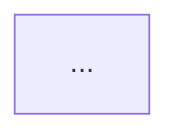

# Task: Generate Diagrams

Generates Mermaid diagrams: one master overview + focused section diagrams.
Requires scan result as input.

## Input
- Scan result
- Entry point files
- Key module files
- Integration/service config files

## Diagram Strategy

### Tier 1: Master Diagram
One comprehensive Mermaid diagram showing the full system: every major component,
their relationships, and all external integrations. The 40,000 foot view.

- Use graph TD by default; use graph LR for strongly left-to-right pipelines
- Label every edge with an action verb (calls, reads, writes, triggers, publishes, etc.)
- Group related nodes using Mermaid subgraphs aligned to key modules from scan result
- Max ~40 nodes

### Tier 2: Section Diagrams
One focused diagram per meaningful subsystem. Each must be independently readable.

| Repo Type       | Section Diagrams to Generate                                 |
|-----------------|--------------------------------------------------------------|
| API / App       | Request flow, Auth flow, Data model (erDiagram)              |
| ETL Pipeline    | Ingestion flow, Transform flow, Load/output flow             |
| Infra/Terraform | Resource dependency graph, Network topology                  |
| Monorepo        | Package dependency graph, per-package flows                  |
| CLI             | Command tree, Execution flow                                 |

Max ~20 nodes per section diagram.

## Mermaid Rules
- Node IDs: no spaces, no special characters except _ and -
- External services use double brackets: DB[(PostgreSQL)]
- User/actor nodes: Actor([User])
- Decision points: {condition?}
- Always wrap in ```mermaid fences

## Output Format

<!-- output: docs/diagrams.md -->

## System Architecture -- Master Diagram
_One-sentence description of what this diagram shows._



---

## [Section Name] Flow
_One-sentence description._


Each diagram gets an H2 title and a one-sentence plain-English description above the code block.
